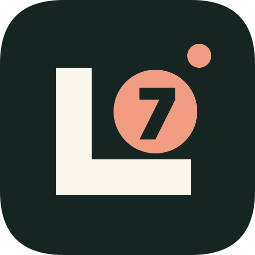

# Lumos Lotto 런처 아이콘

승인된 Lumos A 수정안의 L 모노그램·빛점과 로또 번호 공을 벡터로 구현했습니다. 앱 표시 이름과 패키지 ID는 유지합니다.

- 공통 배경: `#172522`, L: `#FAF7EF`, 기능 심볼·빛점: `#F29C82`.
- `app/src/main/res/drawable/ic_lumos_foreground.xml`: 108dp 전경. 64단위 원본을 1.15배 확대하고 (17.2, 17.2) 이동하여 주요 도형을 중앙 안전 영역에 배치합니다.
- `ic_lumos_monochrome.xml`: 투명 배경의 단색 전경. 숫자 7은 evenOdd 경로로 뚫어 테마 색상에서도 유지합니다.
- `mipmap-anydpi`: 전경·배경·단색 레이어를 가진 적응형 아이콘. 두 앱 모두 Android 8.0 이상만 지원하므로 구형 고정 아이콘이나 v26 복제 리소스는 두지 않습니다. 단색 테마는 이를 지원하는 Android·런처에서 사용합니다.
- `launcher.svg`: 문서·브랜드 미리보기용 원본. 도형 변경 시 Android 전경·단색 리소스와 함께 갱신합니다.

아이콘 확인 시 기존 런처 캐시 때문에 이전 아이콘이 잠시 표시될 수 있습니다. 실제 기기 설치·런처 테마별 확인은 별도 검증 대상입니다.

기준: [Android 적응형 아이콘](https://developer.android.com/develop/ui/compose/system/icon_design_adaptive).
